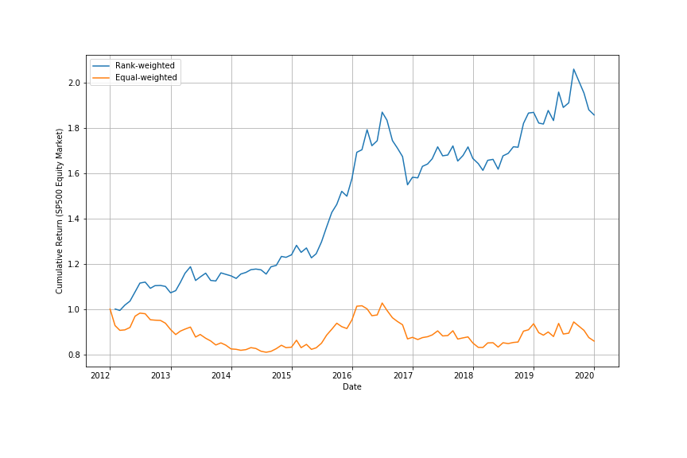
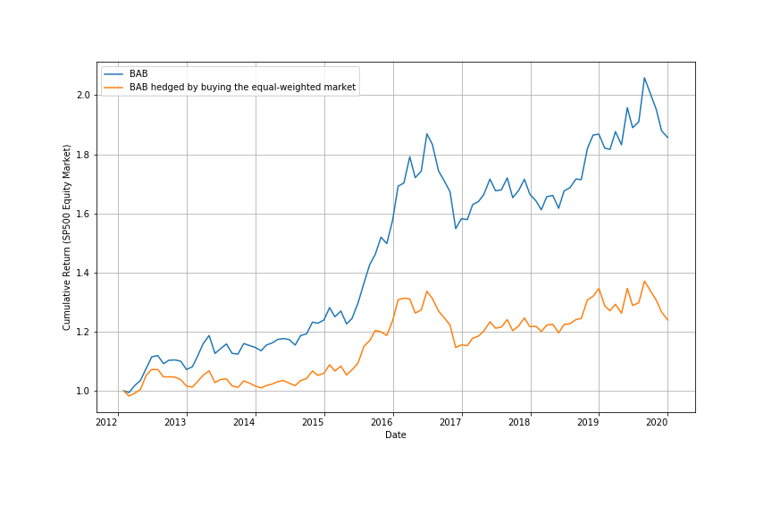

# Betting-Against-Beta

This project is based upon the paper: Frazzini, A. \& Pedersen, L. (2014). *Betting against beta*. (referred to as "the paper" in the following content)

## Data
- `Data` folder stores the fetched data and `Data.py`.

- `Data.py` consists of 2 parts: save tickers, get data. Tickers are processed through website information, data are fetched using 'pandas-datareader'.

## Implementation
- `main.py` contains all the functions.

- `figure.py` is for drawing plots.

## Results

The strategy was back-tested on SP500 stocks and TSX (Toronto Stock Exchange) stocks and compared with two other similar factors presented in the Fama French 3-factor model: one is the SMB (small minus big), the other is the HML (high minus low). (SMB and HML data are collected from [Ken French’s data library](https://mba.tuck.dartmouth.edu/pages/faculty/ken.french/data_library.html)
 equity market (in comparison with the SMB and HML factors)")

 equity market (in comparison with the SMB and HML factors)")

## Evaluation
- Portfolio construction

- Hedging

- Trading cost: Looking at the actual weights the strategy puts on stocks with different market cap, we find out small-cap stocks are overweighted, causing significant implementation issues because the smallest stocks usually have limited capacity and are expensive to trade.

## Reference
1. Andrea Frazzini and Lasse Heje Pedersen. Betting against beta. Journal of Financial Economics, 111(1):1–25, 2014